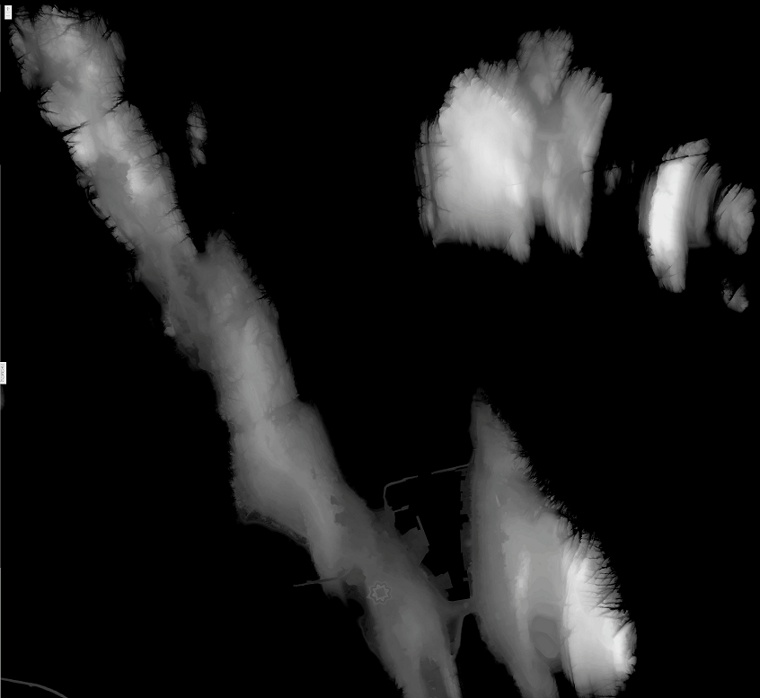

# improved-potato
The goal is to plot RGB pixel values in a 3 dimensional volume matrix to help with interpreting heightmap values to achieve better resolution in terrain generation.

Currently I'm using colored heightmaps  which I feed to my [GrayscaleConverter.cs](https://github.com/kenwi/scripts-misc/blob/master/GrayscaleConverter.cs), guided by the colormap  to produce grayscale heightmaps  which I then use to produce  

